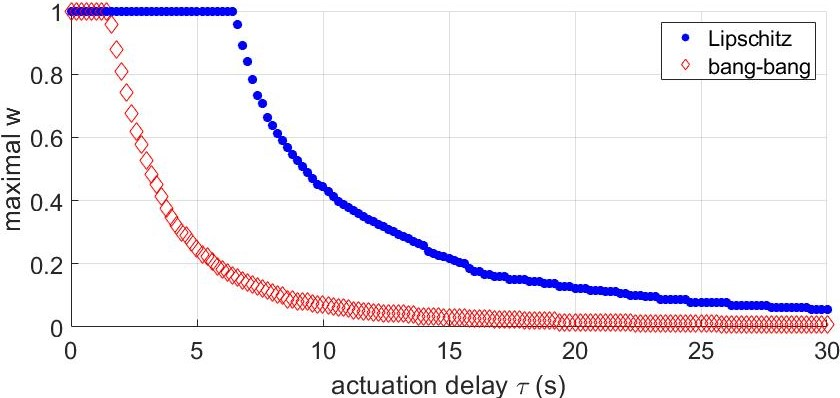

# Spacecraft Resilience to Partial Loss of Control Authority over a Thruster

This project gathers the MATLAB codes used in the paper ["Resilient Trajectory Tracking to Partial Loss of Control Authority over Actuators with Actuation Delay"](https://arc.aiaa.org/doi/abs/10.2514/1.G007652) by Jean-Baptiste Bouvier, Himmat Panag, Robyn Woollands and Melkior Ornik.
This work is published in the [Journal of Guidance, Control, and Dynamics](https://arc.aiaa.org/doi/abs/10.2514/1.G007652) and is also available on [ArXiv](https://arxiv.org/abs/2303.12877).

The fuel-optimal trajectory used as reference trajectory is designed with the convex optimization method described in ["Autonomous optimal trajectory planning for orbital rendezvous, satellite inspection, and final approach based on convex optimization"](https://link.springer.com/article/10.1007/s40295-021-00260-5) from Nicholas Ortolano, see reference below. The convex optimization code used here was written by Himmat Panag.


## Overview

A chaser satellite must conduct an orbital inspection of a target spacecraft. We only study their planar relative dynamics and assume that the chaser has its camera always pointing at the target satellite as shown below.


The reference trajectory that the inspecting spacecraft is trying to track is generated by a convex optimization solver to be fuel-optimal and is represented below in blue. In red is the target spacecraft to be inspected. The yellow circle is the keep-out sphere that the inspecting spaecraft should not enter for safety. The inspecting spacecraft aims at taking pictures of the target spacecraft from the waypoints represented in green.


We produced simulations of the mission in the following [repository ](https://github.com/Jean-BaptisteBouvier/Spacecraft-video). Below is a picture of the inspecting satellite taking a picture of the target with both satellites illustrated 10 times larger than the trajectories scale.


The inspecting satellite loses control authority over one of its thrusters (red). The other four controlled thrusters (cyan) then aim at counteracting its nefarious influence so that the actual trajectory (blue) does not deviate too much from the reference (green). Note that the controlled thrusters suffer from an actuation delay preventing a real-time cancellation of the undesirable thrust.


Below is an accelerated version of the inspection mission with the malfunctioning spacecraft still tracking accurately its reference orbit and taking the 4 pictures of the target satellite.


We quantified the impact of the actuation delay and of the maximal undesirable thrust allowed. The higher the actuation delay $\tau$, the lower the saturation limit of $w$ must be for the tracking to be successful. This relationship can be summarized by a Pareto front shown below.



## Prerequisite

The MATLAB toolboxes [mpt](https://www.mpt3.org/), [cvx](http://cvxr.com/cvx/) and [CORA](https://tumcps.github.io/CORA/) are required to run these codes.


## File Structure


- Folder `functions` contains all the functions that will be called by the scripts of the repository.
- Folder `data` contains the precomputed reference trajectories and undesirable thrust signals. These are computed by the `main` file if not found in the `data` folder. The reference trajectory can be long to compute because of the optimization problem to solve. We store the undesirable thrust signals to be able to reuse them and compare different scenarios.
- Folder `plots` contains all the figures produced by the codes and some illustration generated by the [companion repository](https://github.com/Jean-BaptisteBouvier/Spacecraft-video).
- The file `spacecraft_resilience.m` verifies the resilience of the spacecraft dynamics and compute its reachable set.
- The file `feedback_control.m` computes the parameters $\alpha$, $\beta$, $\gamma$, $\varepsilon$ and $\rho_{max}$ for a choice of matrices $K$, $P$ and $Q$ for the resilient feedback control Theorem 4.
- The file `main.m` computes the resilient trajectory tracking simulation.
- The file `pareto_front.m` calculates the Pareto front on the actuation delay and saturation value of w by running an accelerated version of the tracking simulation.


## Citations

Our work can be cited with:
```
@article{bouvier2023tracking,  
  title = {Delayed Resilient Trajectory Tracking After Partial Loss of Control Authority over Actuators},   
  author = {Jean-Baptiste Bouvier, Himmat Panag, Robyn Woollands and Melkior Ornik},    
  journal = {Journal of Guidance, Control, and Dynamics},    
  year = {2025},   
  volume = {48},  
  number = {3}
}
```

The optimal trajectory design can be cited with:
```
@article{Ortolano,
  title = {Autonomous optimal trajectory planning for orbital rendezvous, satellite inspection, and final approach based on convex optimization},
  author = {Ortolano, Nicholas and Geller, David K and Avery, Aaron},
  journal = {Journal of the Astronautical Sciences},
  pages = {444 -- 479},
  year = {2021},
  volume = {68},
  publisher = {Springer}
}
```


## Contributors

- [Jean-Baptiste Bouvier](https://jean-baptistebouvier.github.io/)
- [Himmat Panag](https://www.linkedin.com/in/himmatpanag/?originalSubdomain=au)
- [Robyn Woollands](https://woollands.web.illinois.edu/index.html)
- [Melkior Ornik](https://mornik.web.illinois.edu/)


